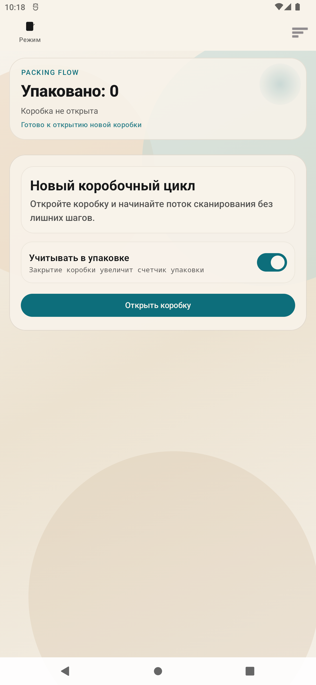
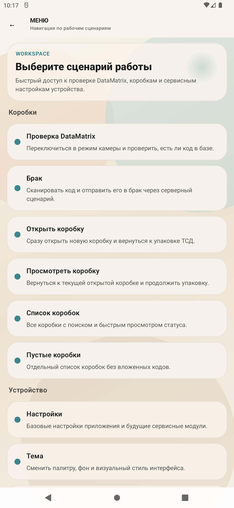
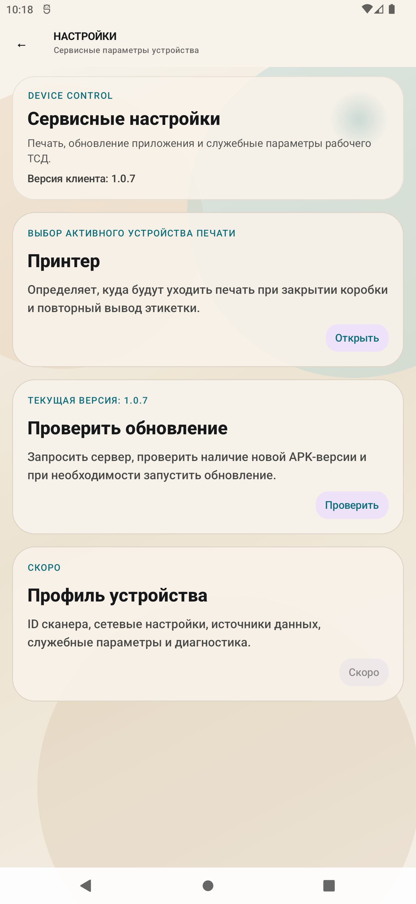

# Сканер ЧЗ

Android-приложение для работы с кодами Честного знака на ТСД и смартфонах:

- проверка Data Matrix на существование в базе;
- упаковка кодов в коробки;
- просмотр, редактирование и печать коробок;
- отправка кода в брак;
- работа через камеру и через встроенный HID/wedge-сканер ТСД;
- автологин, контроль соединения с сервером, обновление APK с backend.

Текущая debug-версия: `1.0.7`

## Что умеет приложение

### 1. Упаковка

Основной экран приложения работает как рабочее место оператора упаковки:

- открытие новой коробки;
- упаковка кодов в коробку через ТСД или камеру;
- переключатель `Учитывать в упаковке`;
- закрытие коробки с печатью;
- удаление пустой открытой коробки;
- удаление отдельных кодов long tap-ом прямо из открытой коробки;
- отдельный статус `ЗАПОЛНЕНА`, если коробка достигла вместимости.

### 2. Проверка Data Matrix

Отдельный экран проверки не смешан с упаковкой.

Что делает:

- сканирует код камерой или ТСД;
- проверяет код через backend `verify/exists`;
- показывает:
  - найден ли код;
  - заказ;
  - устройство;
  - технический статус;
- если код уже был проверен ранее, показывает отдельный статус `ДУБЛИКАТ`;
- успешные проверки помечаются на backend как верифицированные.

### 3. Брак

Отдельный экран `Брак` вынесен в меню.

Что делает:

- сканирует код камерой или ТСД;
- отправляет его на backend endpoint брака;
- показывает результат отправки;
- если код был удален из коробки, показывает из какой именно коробки он был снят.

### 4. Работа с коробками

Из меню доступны:

- `Открыть коробку`
- `Просмотреть коробку`
- `Список коробок`
- `Пустые коробки`

На экранах коробок есть:

- просмотр карточки коробки;
- просмотр вложенных кодов;
- режим редактирования;
- удаление кода из коробки;
- удаление пустой коробки;
- повторная печать этикетки.

### 5. Сервисные функции

- выбор активного принтера для ТСД;
- настройка звуков;
- выбор темы интерфейса;
- ручная проверка обновления;
- автообновление APK с backend;
- контроль WebSocket-соединения с сервером;
- блокирующее предупреждение при потере связи;
- диалог подтверждения выхода из приложения.

## Скриншоты

Скриншоты ниже сняты со свежей debug-сборки в Android Emulator и показывают текущий интерфейс приложения.

### Главный экран упаковки



### Главное меню



### Сервисные настройки



## Архитектура

Проект собран как многослойное приложение без смешивания UI и бизнес-логики.

### Слои

- `feature`
  Экраны, `ViewModel`, UI state, навигационные сценарии.
- `domain`
  Модели, use case, контракты репозиториев, парсер.
- `data`
  Retrofit API, DTO, репозитории, Room, seed-данные.
- `core`
  Общие компоненты: scanner, runtime, audio, theme, device identity.
- `app`
  Корневая навигация, runtime orchestration, app-level state.
- `di`
  Hilt wiring.

### Структура пакетов

```text
app/src/main/java/ru/devandprod/chestniyznak/
├── app
├── core
├── data
├── di
├── domain
├── feature
├── MainActivity.kt
└── ChestniyZnakApplication.kt
```

### Почему так

Такое разделение уже сейчас позволяет:

- независимо расширять упаковку, верификацию и брак;
- добавлять новые endpoint'ы без переписывания UI;
- переиспользовать общий scanner/UI toolkit между несколькими сценариями;
- держать backend-контракты и UI независимо тестируемыми.

## Технологии

- `Kotlin`
- `Jetpack Compose`
- `Material 3`
- `Hilt`
- `Retrofit`
- `OkHttp`
- `kotlinx.serialization`
- `Room`
- `CameraX`
- `ML Kit Barcode Scanning`
- `WebSocket` через `OkHttp`
- `Gradle Kotlin DSL`

## Основные сценарии работы

### Упаковка в коробку

1. Оператор открывает коробку.
2. Приложение получает текущую открытую коробку с backend.
3. Оператор сканирует коды встроенным сканером ТСД или камерой.
4. Каждый код уходит на `packing/boxes/{boxId}/scan`.
5. Backend возвращает:
   - успешное добавление;
   - `duplicate_in_box`;
   - `code_in_other_box`;
   - `wrong_order`;
   - `scan_rejected`;
   - сигнал заполнения коробки.
6. Приложение отображает результат и проигрывает нужный звук.
7. При закрытии коробки backend печатает этикетку и возвращает итоговое состояние.

### Проверка Data Matrix

1. Оператор открывает `Проверка DataMatrix`.
2. Выбирает вход: камера или ТСД.
3. Код уходит на `verify/exists`.
4. Backend отвечает:
   - найден код или нет;
   - статус;
   - заказ;
   - устройство;
   - был ли это дубликат.
5. На экране показывается читаемый результат, без смешивания с упаковкой.

### Брак

1. Оператор открывает `Брак`.
2. Сканирует код камерой или ТСД.
3. Код уходит на `POST /chestniy-znak/laser/defect`.
4. Backend:
   - верифицирует код;
   - при необходимости снимает его с коробки;
   - переводит код в defect-пул.
5. Приложение показывает финальный статус и служебную информацию.

## Backend endpoints

Базовый URL:

```text
http://srv-dnp.argos.loc/api/v2/
```

### Аутентификация

- `POST /accounts/login/token`
- `GET /auth-check`
- `POST /accounts/logout`

### Верификация

- `POST /chestniy-znak/verify`
- `POST /chestniy-znak/verify/exists`
- `GET /chestniy-znak/catalog/stats`

### Упаковка

- `GET /chestniy-znak/packing/boxes/current`
- `POST /chestniy-znak/packing/boxes/open`
- `PATCH /chestniy-znak/packing/boxes/{boxId}/count-in-packing`
- `POST /chestniy-znak/packing/boxes/{boxId}/scan`
- `POST /chestniy-znak/packing/boxes/{boxId}/close`
- `GET /chestniy-znak/packing/boxes`
- `GET /chestniy-znak/packing/boxes/{boxId}`

### Редактирование коробки

- `POST /chestniy-znak/packing/box-edit/{boxId}/open`
- `POST /chestniy-znak/packing/box-edit/{boxId}/items/remove`
- `POST /chestniy-znak/packing/box-edit/{boxId}/clear`
- `DELETE /chestniy-znak/packing/box-edit/{boxId}/empty`

### Принтер

- `GET /chestniy-znak/packing/printer/printers?device_id=...`
- `POST /chestniy-znak/packing/printer/printer-selection`
- `POST /chestniy-znak/packing/printer/boxes/{boxId}/print?device_id=...`

### Брак

- `POST /chestniy-znak/laser/defect`

### Runtime

- `GET /chestniy-znak/apk/latest`
- `GET /chestniy-znak/apk/latest/download`
- `ws://host/ws/chestniy-znak/client/?device_id=...`

## Требования

- `JDK 17`
- Android SDK
- Android Studio с поддержкой Compose
- `adb` для установки на устройство

Минимальный SDK приложения:

- `minSdk = 26`

Целевой SDK:

- `targetSdk = 35`

## Как собрать проект

### 1. Сборка debug APK

Из корня проекта:

```bash
./gradlew assembleDebug
```

Готовый APK:

```text
app/build/outputs/apk/debug/app-debug.apk
```

### 2. Прогон unit-тестов

```bash
./gradlew testDebugUnitTest
```

### 3. Полная базовая проверка перед загрузкой APK

```bash
./gradlew testDebugUnitTest assembleDebug
```

### 4. Установка на устройство через `adb`

```bash
adb install -r app/build/outputs/apk/debug/app-debug.apk
```

### 5. Перезапуск приложения на устройстве

```bash
adb shell am force-stop ru.devandprod.chestniyznak
adb shell am start -n ru.devandprod.chestniyznak/.MainActivity
```

## Как собирать из Android Studio

1. Открыть проект в Android Studio.
2. Дождаться `Gradle Sync`.
3. Выбрать конфигурацию `app`.
4. Нажать `Run` для запуска на устройстве или `Build APK(s)` для сборки APK.

## Логи и отладка

### Logcat

Полезные теги:

- `ChestniyZnak`
- `ChestniyZnakWS`

Примеры:

```bash
adb logcat | grep ChestniyZnak
adb logcat | grep ChestniyZnakWS
```

### Что логируется

- raw scan input;
- нормализованный код;
- статусы верификации;
- серверные ответы по упаковке;
- websocket lifecycle;
- ручные retry и reconnect;
- загрузка и установка APK.

## Сетевые и runtime-особенности

- приложение работает с backend по `HTTP`;
- тестовый токен сейчас захардкожен в `BuildConfig.AUTH_TOKEN`;
- WebSocket поднимается автоматически при старте authenticated-flow;
- при потере связи показывается блокирующая модалка;
- есть ручной retry с cooldown;
- после восстановления связи показывается отдельное уведомление;
- проверка обновления запускается автоматически при старте и вручную из настроек.

## Ресурсы и локальные данные

### Seed-данные

Стартовые локальные данные:

- `app/src/main/assets/seed/chestniy_znak_codes.json`

### Векторные ресурсы

В проекте используются собственные векторные ресурсы для:

- иконки приложения;
- режима `камера / ТСД`;
- диалога подтверждения выхода.

### Скриншоты для README

Лежат здесь:

- `docs/screenshots/scanner-main.png`
- `docs/screenshots/scanner-polish.png`
- `docs/screenshots/settings-polish.png`

При необходимости их можно заменить на более свежие capture из реального ТСД.

## Тесты

Сейчас есть unit-тесты на:

- парсер Data Matrix;
- сравнение версий APK;
- DTO-мэппинг verify;
- DTO-мэппинг packing;
- DTO-мэппинг printer;
- сценарии:
  - `order_name`
  - `device_name`
  - `DUPLICATE_SCAN`
  - `defect response`

Основные тестовые файлы:

- `app/src/test/java/ru/devandprod/chestniyznak/domain/parser/ChestniyZnakParserTest.kt`
- `app/src/test/java/ru/devandprod/chestniyznak/core/runtime/VersionComparatorTest.kt`
- `app/src/test/java/ru/devandprod/chestniyznak/data/remote/dto/ChestniyZnakDtosTest.kt`
- `app/src/test/java/ru/devandprod/chestniyznak/data/remote/dto/PackingDtosTest.kt`
- `app/src/test/java/ru/devandprod/chestniyznak/data/remote/dto/PrinterDtosTest.kt`

## Что важно знать перед релизом

- сейчас в debug и release конфигурации используется `AUTH_TOKEN = "testtokentablet"`;
- backend URL зашит как `http://srv-dnp.argos.loc/api/v2/`;
- release signing в этом README не описан, потому что keystore не включен в репозиторий;
- перед production-релизом стоит:
  - вынести токен из `BuildConfig`;
  - перевести обновление/логин на рабочую схему авторизации;
  - проверить release signing;
  - отдельно прогнать реальные сценарии на ТСД.

## Полезные команды

### Проверить статус git

```bash
git status
```

### Посмотреть последние коммиты

```bash
git log --oneline -n 10
```

### Очистить build-артефакты

```bash
./gradlew clean
```

## Текущее состояние

Проект уже не MVP в узком смысле. Это рабочее приложение для ТСД/Android с разделенными сценариями:

- упаковка;
- проверка Data Matrix;
- брак;
- управление коробками;
- runtime-контроль соединения;
- обновление клиента;
- настройка принтера, темы и звуков.

README можно дальше дополнять уже по мере появления:

- актуальных скриншотов с реального ТСД;
- release-инструкции;
- описания backend ролей и прав;
- схемы обмена с 1С и производственными системами.
